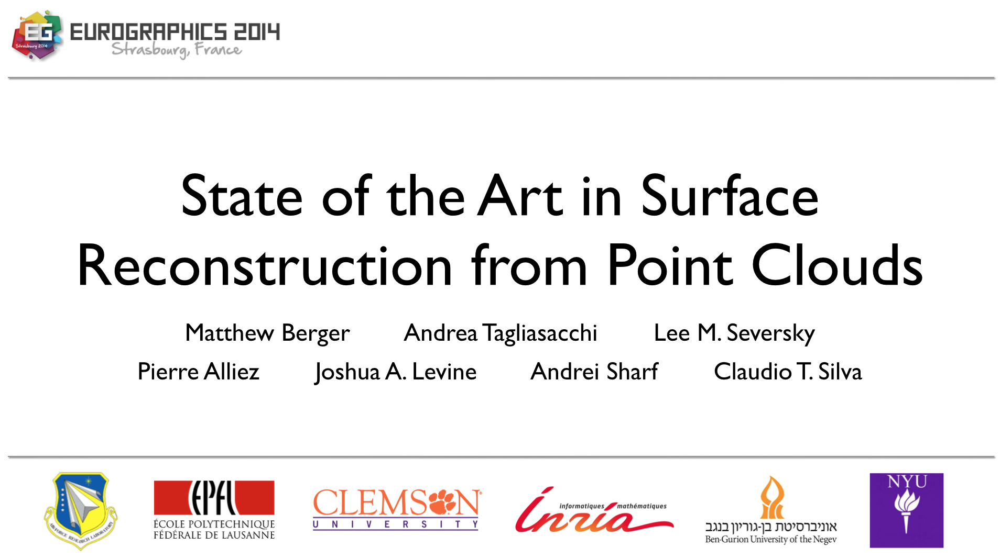

<!--  -->

## Abstract
The area of surface reconstruction has seen substantial progress in the past two decades. The traditional problem addressed by surface reconstruction is to recover the digital representation of a physical shape that has been scanned, where the scanned data contains a wide variety of defects. While much of the earlier work has been focused on reconstructing a piece-wise smooth representation of the original shape, recent work has taken on more specialized priors to address significantly challenging data imperfections, where the reconstruction can take on different representations – not necessarily the explicit geometry. This state-of-the-art report surveys the field of surface reconstruction, providing a categorization with respect to priors, data imperfections, and reconstruction output. By considering a holistic view of surface reconstruction, this report provides a detailed characterization of the field, highlights similarities between diverse reconstruction techniques, and provides directions for future work in surface reconstruction.

## Downloads
Disclaimer: The paper listed on this page is copyright-protected. By clicking on the paper link below, you confirm that you or your institution have the right to access the corresponding pdf file. Note that the definitive version can be downloaded from diglib.eg.org

Paper PDFs (~15 MB each):
  
  - [Computer Graphics Forum 2016 (extended journal - 2nd version)](/pubs/2016/berger_cgf16/paper.pdf)
  - [EuroGraphics 2014 (STAR report -- 1st version)](paper.pdf) 
  
Slides PDFs (~50MB each):
  
  - [Introduction](slides/1_intro.pdf)
  - [Surface smoothness priors](slides/2_smooth_priors.pdf)
  - [Low level priors](slides/3_lowlevel_priors.pdf)
  - [High level priors](slides/4_highlevel_priors.pdf)
  - [Conclusions](slides/5_conclusions.pdf) 
  
## Bibtex Reference
    @article{reconstar_eg14, 
       title = {State of the Art in Surface Reconstruction from Point Clouds}, 
       author = {Matthew Berger and Andrea Tagliasacchi and Lee M. Seversky and Pierre Alliez and 
                 Joshua A. Levine and Andrei Sharf and Claudio Silva}, 
       journal = {Eurographics STAR (Proc. of EG'14) }, 
       year = 2014}

## Acknowledgements
We would like to thank Misha Kazhdan, Gael Guennebaud, Mark Pauly, Mario Botsch, Yaron Lipman, Florent Lafarge, Gael Guennebaud, Oliver Mattausch and Alexandre Sorkine-Hornung as well as the reviewers for their valuable feedback.
