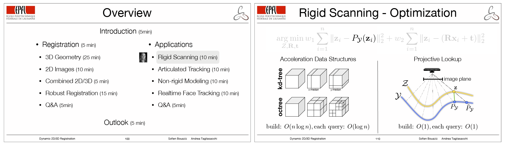

# Conference Course: Dynamic 2D/3D Registration


## Abstract
Presented by: [Sofien Bouaziz](http://lgg.epfl.ch/~bouaziz), [Andrea Tagliasacchi](/people/ataiya), [Hao Li](http://hao.li), [Mark Pauly](http://lgg.epfl.ch) 

<div align="justify">
Registration algorithms are an essential component of many computer graphics and computer vision systems. With recent technological advances in RGB-D sensors~(color plus depth), an active area of research is in techniques combining color, geometry, and learnt priors for robust real-time registration. The goal of this course is to introduce the mathematical foundations and theoretical explanation of registration algorithms, in addition to the practical tools to design systems that leverage information from RGBD devices. We present traditional methods for correspondence computation derived from geometric first principles, along with modern techniques leveraging pre-processing of annotated datasets (e.g. deep neural networks). To illustrate the practical relevance of the theoretical content, we discuss applications including static and dynamic scanning/reconstruction as well as real-time tracking of hands and faces.
</div>

## Presentation Venues
- [[2016] SIGGRAPH Asia - Macau, China](https://sa2016.siggraph.org)
- [[2015] Symposium on Geometry Processing - Graz, Austria](http://www.geometrie.tugraz.at/sgp2015)
- [[2014] EuroGraphics - Zurich, Switzerland](http://eg2014.unistra.fr) 
- [[2013] SIGGRAPH - Anaheim, USA](http://s2013.siggraph.org)

## Downloads
- [Course Notes (PDF, 40MB)](/pubs/2016/registration/course.pdf)
- [Source Code (Matlab, 1MB)](/pubs/2016/registration/source.zip)
- [Slides (PDF)](/pubs/2016/registration/slides)

## Bibtex
```
@article{regcourse_siga16,
Author = {Sofien Bouaziz and Andrea Tagliasacchi and Hao Li and Mark Pauly},
Journal = {Proc. SIGGRAPH Asia (Technical Course Notes)},
Title = {Modern Techniques and Applications for Real-Time Non-rigid Registration},
Year = {2016}}
```